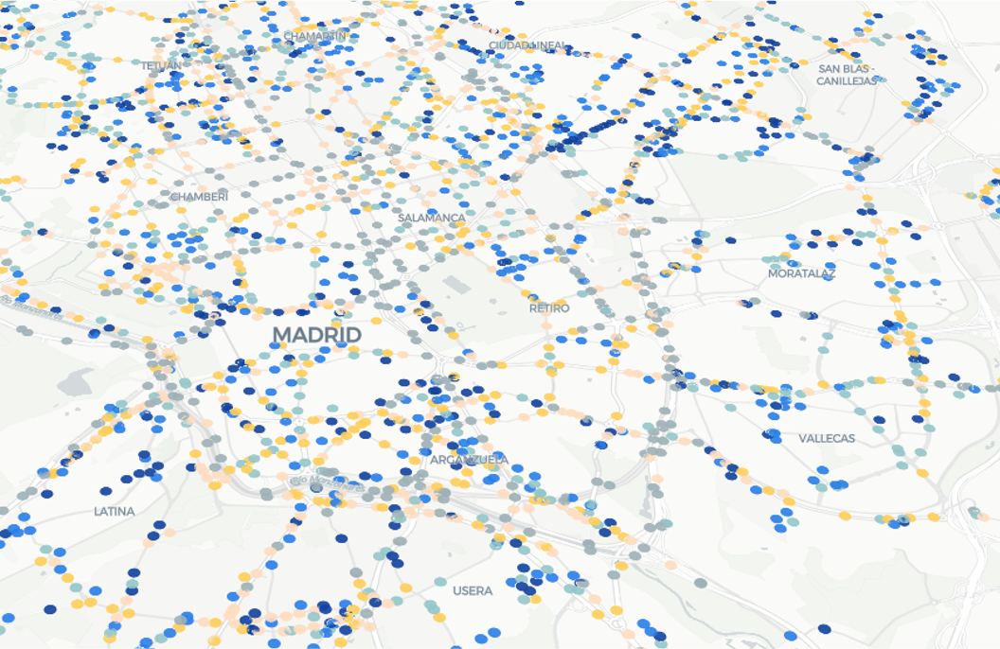
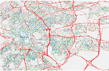
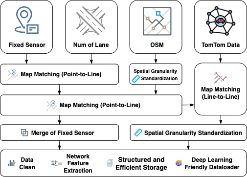

# MMTD: Metropolitan Multi-source Traffic Data

A **large-scale, spatio-temporally aligned multi-source traffic dataset** at metropolitan scale, built for deep learning and traffic state inference. MMTD standardizes heterogeneous fixed sensors and floating car data onto a unified road network, providing a reproducible benchmark for data-driven traffic dynamics modeling.

## Data Access

The **processed fixed-sensor data** (excluding floating car data) is publicly available on Zenodo:

[](https://doi.org/10.5281/zenodo.18781181)

- **Zenodo Record:** [https://doi.org/10.5281/zenodo.18781181](https://doi.org/10.5281/zenodo.18781181)
- **Version:** v1.0
- **Contents:** Processed fixed-sensor data, graph topology, and static road attributes

> **Note on Floating Car Data:** TomTom floating car data is **not included** in the Zenodo release, as TomTom is a commercial data provider. Users can obtain TomTom Traffic Stats data directly from [TomTom Developer Portal](https://developer.tomtom.com/move-portal/guides/traffic-stats/introduction) under their terms. We provide binding scripts/notebooks to align your own TomTom data with our processed fixed-sensor data to construct the complete MMTD.

## Overview

- **Spatial scope:** Madrid metropolitan area  
- **Temporal resolution:** 15 minutes (aligned across sources)  
- **Road segments:** 25,166 (OSM-based, intersection-to-intersection)  
- **Fixed sensors:** 2,476 (2,371 urban + 105 highway)  
- **Floating car (TomTom):** full network coverage except for living streets. 

MMTD includes **traffic state variables** (flow, speed, travel time, occupancy, congestion index where available), **road static attributes** (length, lanes, speed limit), and **graph topology** (adjacency, betweenness/closeness centrality).

## Data Sources

| Source | Description | Access |
|--------|-------------|--------|
| **Fixed sensors** | Madrid traffic authority; ~4,678 loop detectors; 15-min historical data; flow, occupancy, speed (highway), congestion index (urban). [Ref](https://datos.madrid.es/) | ✅ [Zenodo](https://doi.org/10.5281/zenodo.18781181) |
| **Floating car** | TomTom Traffic Stats; 15-min aggregates (flow, speed, travel time) on TomTom's own segment geometry. [Ref](https://developer.tomtom.com/move-portal/guides/traffic-stats/introduction) | ⚠️ Not redistributed (commercial). Obtain from [TomTom](https://developer.tomtom.com/move-portal/guides/traffic-stats/introduction) |
| **Road network** | OpenStreetMap (OSM) as the reference network and for topology. | ✅ OpenStreetMap |
| **Lane counts** | Madrid planning authority; used for lane-level flow normalization. | ✅ [Zenodo](https://doi.org/10.5281/zenodo.18781181) |

*Analysis period: August 2024.*

<p align="center">
  
  
</p>
<p align="center">
  <em>Left: Fixed sensors (Madrid). Right: TomTom floating car coverage.</em>
</p>

## Pipeline Summary

MMTD is built through a standardized pipeline:

1. **Layer matching**
   - **Point–line:** Match fixed sensors to lane-count layer, then to OSM segments (distance + heading + road-type constraints; search radius 15 m urban / 20 m highway).
   - **Line–line:** Match OSM segments to TomTom network via HMM-based map matching (e.g. [leuvenmapmatching](https://github.com/wmeert/leuvenmapmatching)), with heading consistency and overlap-ratio checks.

2. **Spatial normalization**
   - OSM: merge degree-2 nodes to get intersection-to-intersection segments.
   - TomTom: map and aggregate TomTom segments onto these OSM segments (length-weighted flow; harmonic-mean speed). Highway: further split into ~500 m sub-segments.

3. **Fixed-sensor merge & cleaning**
   - Merge co-located lane-level sensors (sum flow, average speed).
   - Drop sensors with &lt;80% valid ratio; adaptive outlier removal (IQR / 3σ by distribution). No imputation (to preserve evaluation of reconstruction methods).

4. **Graph & packaging**
   - Road segments → graph nodes; connectivity → edges. Features: geography, length, lanes, speed limit, betweenness/closeness centrality.
   - Outputs: adjacency matrix, node features, fixed-sensor and floating-car state tensors (e.g. `T × N × F`), HDF5 + PyG-style dataset and loaders with optional observation masks.



## Dataset Structure (High Level)

- **Graph:** adjacency (sparse), node features (geo + static + centrality).
- **Fixed sensor:** `T × N_s × F_s` (e.g. flow, occupancy, speed/congestion).
- **Floating car:** `T × N_f × F_f` (e.g. flow, speed, travel time); `N_f` covers full network.
- **Alignment:** common segment IDs link all components.

## Repository Contents

- **Processing code:** pipeline for layer matching, spatial normalization, cleaning, and graph/dataset construction.
- **Processed fixed-sensor data:** publicly available on [Zenodo](https://doi.org/10.5281/zenodo.18781181) (CC BY 4.0 license).
- **TomTom binding:** scripts/notebooks to align fixed-sensor data with TomTom (users supply their own TomTom data under [TomTom’s terms](https://developer.tomtom.com/move-portal/guides/traffic-stats/introduction)).
- **Data loaders:** PyG-compatible dataset interface with graph sampling and configurable observation masks.

*Raw TomTom data is not redistributable; only processing methodology and processed fixed-sensor outputs are shared.*

## Getting Started

1. Clone the repo and install dependencies (see `requirements.txt` or environment files in the repo).
2. Use the provided scripts/notebooks to reproduce the pipeline or load preprocessed fixed-sensor data.
3. To obtain full MMTD (fixed + TomTom), acquire TomTom data for the same period/area and run the binding notebooks.
4. Load the PyG dataset via the custom loader for training/evaluation (e.g. state estimation, imputation, forecasting).

*Specific commands and example snippets will be added as the repository is populated.*

## Citation

If you use MMTD in your work, please cite:

### Dataset (Zenodo)

When using the **processed data**, please cite the Zenodo record:

```bibtex
@dataset{zhou2026mmtd,
  author       = {Zhou, Qishen},
  title        = {MMTD: Madrid Fixed-Sensor Traffic Data (Processed
                   Sample for Reproducible Research)},
  month        = feb,
  year         = {2026},
  publisher    = {Zenodo},
  version      = {v1.0},
  doi          = {10.5281/zenodo.18781181},
  url          = {https://doi.org/10.5281/zenodo.18781181}
}
```

### Thesis Reference

```bibtex
@phdthesis{zhou2025mmtd,
  author = {Qishen Zhou},
  title  = {[Thesis title; to be updated]},
  school = {Zhejiang University},
  year   = {2025},
  note   = {MMTD dataset: Metropolitan Multi-source Traffic Data}
}
```

*Replace with the final thesis citation once published.*

## References

- Madrid open data: [datos.madrid.es](https://datos.madrid.es/)
- TomTom Traffic Stats: [developer.tomtom.com](https://developer.tomtom.com/move-portal/guides/traffic-stats/introduction)
- OSM/OSMnx: [osmnx](https://github.com/gboeing/osmnx)
- HMM map matching: Newson & Krumm (2009); [leuvenmapmatching](https://github.com/wannesm/LeuvenMapMatching)

## License

- **Code and processing scripts:** [MIT License](LICENSE) — use, modify, and distribute freely; keep the copyright notice.
- **Processed data** we distribute in this repository: **CC BY 4.0** — attribution appreciated; otherwise use freely. ([Summary](https://creativecommons.org/licenses/by/4.0/))
- **Underlying data sources** (Madrid, TomTom, OSM) are subject to their own terms; see the references above. We do not grant rights beyond what those sources allow.
